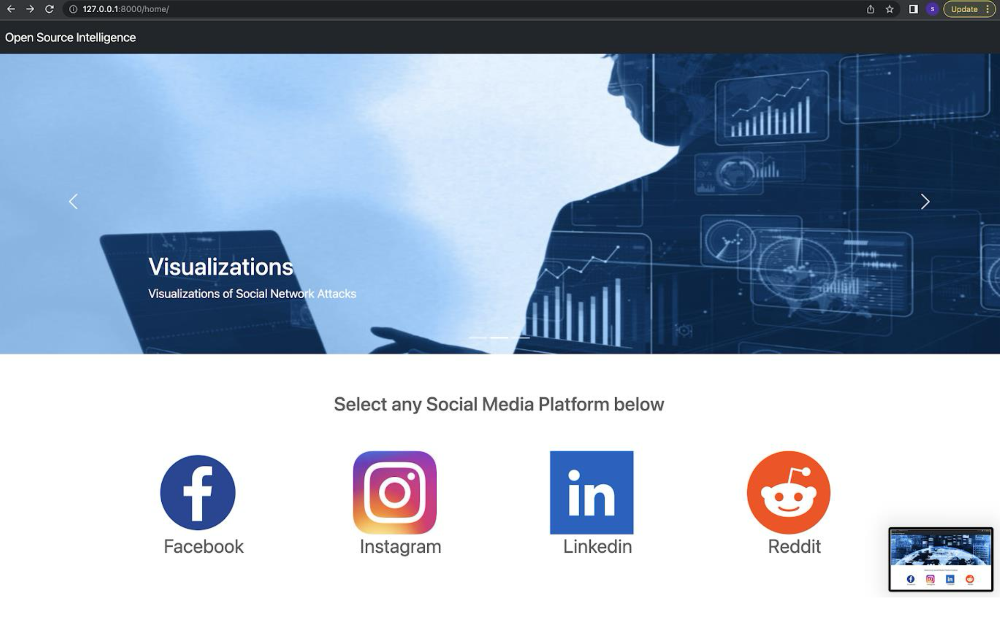
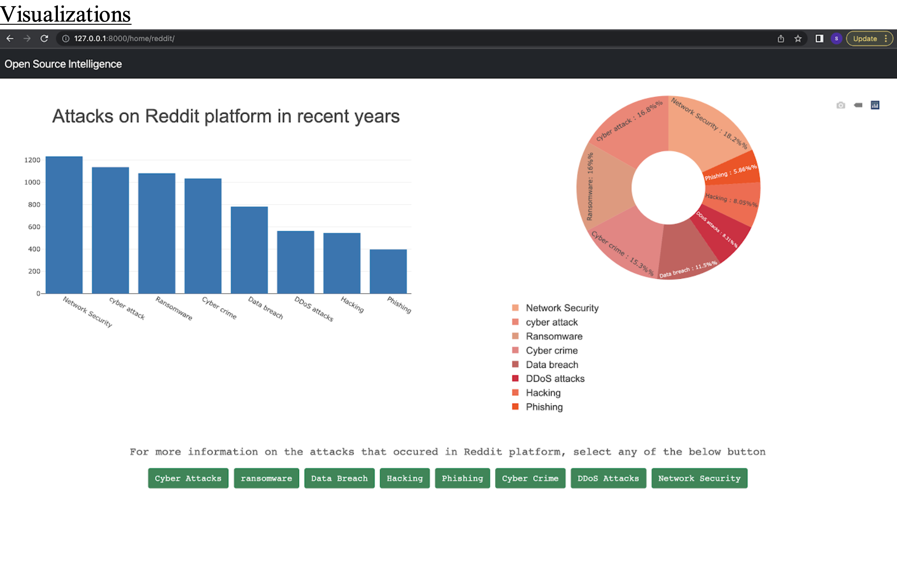

# Social Media Analysis Using Open-Source Intelligence (OSINT)

## Overview
This project focuses on analyzing publicly available data from social media platforms using Open-Source Intelligence (OSINT) techniques. The analysis covers three key areas:
1. **Threat Analysis**: Identifying cyber threats related to each platform.
2. **User-Geographical Area Analysis**: Analyzing the geographical distribution of users.
3. **Trend Analysis**: Identifying and visualizing the most popular trends across platforms like Reddit, Facebook, Instagram, and LinkedIn.

## Features
- **Threat Detection**: Identifies the key security threats faced by each social media platform.
- **Geographical Insights**: Displays the global distribution of users across various social media platforms.
- **Trending Topics**: Shows the trending topics and discussions on the chosen platforms.
- **Visualizations**: Provides visual representations of the analyzed data using graphs and charts.

## Technologies Used
- **Backend**: Python (with Django framework)
- **Frontend**: HTML, CSS
- **Web Scraping**: Python libraries such as `BeautifulSoup` and APIs (e.g., Twitter API)
- **Data Analysis**: Pandas, Matplotlib, Seaborn
- **Database**: MySQL/PostgreSQL (relational database), MongoDB (NoSQL database)

## Setup Instructions
1. **Clone the Repository**:
   ```bash
   git clone https://github.com/yourusername/osint-social-media-analysis.git
   ```
2. Navigate to the Project Directory:
   ```bash
   cd osint-social-media-analysis
   cd osi
   ```
3. Run the Django Server:
   ```bash
   python manage.py runserver
   ```
4. Access the Application:
   Open a browser and go to http://127.0.0.1:8000.

## How it Works
1. The user selects a social media platform (Reddit, Facebook, Instagram, or LinkedIn).
2. The system scrapes publicly available data from these platforms using APIs or web scraping techniques.
3. The data is processed, analyzed, and visualized using tools such as Pandas and Matplotlib.
4. The user can view results in three main categories:
   - Threat Analysis: View cybersecurity threats faced by the platform.
   - User Distribution: See the geographical distribution of users.
   - Trending Topics: Discover current trends and topics being discussed on the platform.

## Results
We provide detailed visualizations, such as bar charts, which show:
 - Number of posts by day of the week (Reddit example).
 - Geographical distribution of users.
 - Identified cybersecurity threats on different platforms.

## Screenshots
### Dashboard


### Threat Analysis


## Future Enhancements
- Extend support for more social media platforms.
- Improve threat analysis using advanced machine learning models.
- Automate trend detection with real-time data.
